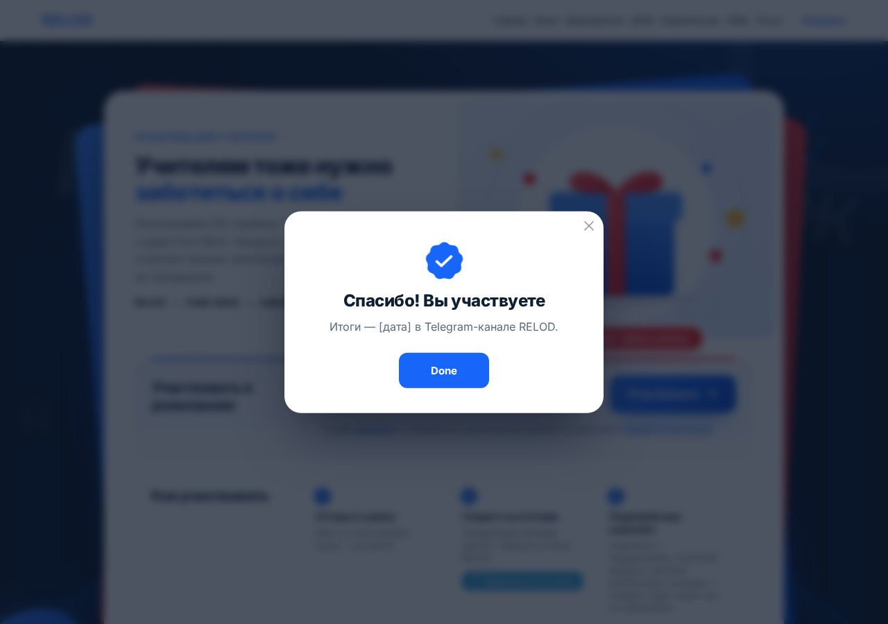

# Розыгрыш ко Дню учителя — лендинг-окно для Tilda

Секции из макета заказчика собраны в одно окно в стиле сайта: тёмно-синий фон, белое окно
с синим и красным листами за ним, кольца, точечная сетка и буквы на фоне.

| Макет | Где в окне |
|---|---|
| 1. Шапка | Нативный хедер, скопированный со страницы /tesol, ставится **над** блоком T123 |
| 2. Первый экран | Верх окна: надзаголовок, заголовок, текст, партнёры; справа картинка с плашкой «5 октября — День учителя» |
| 3. Форма заявки | Панель «Участвовать в розыгрыше»: имя, e-mail и кнопка в одну строку, ниже согласие |
| 4. Как участвовать | Три карточки в ряд, на телефоне — столбиком; во второй кнопка на Telegram |
| 5. Правила и подвал | Под окном: ссылка на PDF правил, организаторы, контакты, соцсети |

На компьютере окно широкое и компактное: текст слева, картинка справа. На телефоне всё
идёт одной колонкой. Форма родная, поэтому заявки уходят в **Tilda CRM** и в раздел «Заявки».

| Компьютер | Телефон | После отправки |
|---|---|---|
|  |  |  |

## Идея

Страница собрана из двух блоков.

- **T123 (HTML-код)** отвечает за внешний вид: фон, окно, картинку и тексты.
- **Нативный блок формы Tilda** принимает и отправляет заявки. При загрузке страницы скрипт
  переносит этот блок внутрь окна целиком и перекрашивает его. Заголовок, описание и
  картинка самого блока прячутся, видна только форма.

Отправкой занимается сама Tilda. Вместе с формой работают её валидация, маска телефона,
защита от спама, окно «Спасибо» и все подключённые получатели: Tilda CRM, почта,
amoCRM, Bitrix24 и другие.

## Установка (5 минут)

1. **Создайте пустую страницу**: «Создать страницу», затем «Пустая страница».
2. **Добавьте блок T123**: «Все блоки», раздел «Другое», блок «HTML-код».
   В «Контент» вставьте **весь** код из [`t123-lead-form.html`](t123-lead-form.html).
3. **Над блоком T123 вставьте шапку**: на странице /tesol выберите у хедера «Скопировать блок»
   и вставьте его сюда. Пункт «Конкурсы» отметьте как активный.
4. **Под блоком T123 добавьте блок формы BF204N** («Вертикальная форма с множеством полей»,
   категория «Форма»). В его «Контенте» настройте поля, как в макете:
   - «Имя», переменная `name`, обязательное;
   - «Email», переменная `email`, обязательное;
   - чекбокс согласия, обязательный, со ссылками на политику ПД и правила розыгрыша;
   - скрытое поле `source` со значением `den_uchitelya_2026`, чтобы отличать заявки конкурса;
   - текст кнопки: «Участвовать»;
   - сообщение об успешной отправке: «Спасибо! Вы участвуете. Итоги — [дата] в Telegram RELOD».

   Подписи «Ваше имя» и «Ваш e-mail» впишите в подсказки полей (placeholder): на компьютере поля
   стоят в одну строку и подписи над ними скрыты.

   Заголовок и описание блока можно не заполнять: на странице они всё равно скрыты.
5. **Подключите Tilda CRM.** В блоке формы откройте «Контент», найдите раздел
   «Приём данных из формы» и отметьте **Tilda CRM**. Если CRM ещё не создана, создайте её
   в главном меню, пункт «CRM». По макету можно добавить и e-mail или Google Таблицу.
6. **Опубликуйте страницу** и отправьте тестовую заявку. Она появится в Tilda CRM и в разделе
   «Заявки» сайта.

> В редакторе Tilda код T123 не выполняется, поэтому там форма стоит отдельным блоком под окном.
> Внутрь окна она встаёт в «Предпросмотре» и на опубликованной странице.

## Как менять контент

Всё, что нужно менять, собрано в начале кода T123 под пометкой `КОНТЕНТ · меняйте здесь`.

| Что | Где |
|---|---|
| Картинка | `src="…"` у ``. Пока он пустой, показывается иллюстрация-подарок. Подойдёт прямая ссылка на фото: пилатес в Pure Mind или комплект amarèssence. |
| Плашка на картинке | `<figcaption class="lf__badge">`. Пусто — плашка скроется. |
| Надзаголовок | `
`. Пусто — скроется. |
| Заголовок | `<h1 class="lf__title">`. Текст внутри `<em>` выделяется синим. |
| Текст под заголовком | `
`. Замените `[N]` на число мест. |
| Партнёры | `
`. Пусто — скроются. |
| Заголовок формы | `
` |
| Как участвовать | `<li>` внутри `
`: замените `[дата]`, шаги можно добавлять и удалять. Ссылка Telegram — у `<a class="lf__tg">`. |
| Правила, контакты, соцсети | `<footer class="lf__foot">`: ссылка на PDF правил (сейчас `#`), ссылки VK и Дзен (сейчас `#`). |
| Пропорции картинки | `--lf-img-ratio` в «НАСТРОЙКИ ДИЗАЙНА» |
| Цвета, шрифт, скругление, ширина окна | Переменные `--lf-…` в «НАСТРОЙКИ ДИЗАЙНА» в начале `<style>` |
| Буквы на фоне | `data-glyphs="A Ж ß é …"` у `#lf-root`. Пусто — без букв. |
| Поля, кнопка, «Спасибо», получатели заявок | В блоке формы BF204N, раздел «Контент» |

Что нужно получить от заказчика: число мест `[N]`, даты приёма заявок и итогов, фото для первого
экрана, PDF правил, ссылки VK и Дзен.

### Если на странице несколько форм

По умолчанию в окно встаёт первая форма на странице. Чтобы выбрать другую, впишите её ID
в `data-form-rec`, например `data-form-rec="rec123456789"`. ID блока написан внизу его
панели «Настройки».

### Если в окне написано «Форма не найдена»

На странице нет подходящего блока формы. Добавьте блок BF204N из категории «Форма». Если
форм несколько, проверьте ID в `data-form-rec`.

## Что проверено

Код проверен в Chromium на макете опубликованной страницы Tilda с настоящими скриптами
Tilda (`tilda-forms-1.0`, `tilda-phone-mask-1.1`).

- Блок формы переезжает внутрь окна, а нативные стили Tilda перекрываются.
- Скрытое поле `source=den_uchitelya_2026` уходит вместе с заявкой.
- Валидация и подсветка ошибок работают ([скриншот](screens/errors.jpg)).
- На одно нажатие кнопки уходит **ровно одна** заявка. В ней правильные `formid`,
  `formskey` и получатели (`formservices[]`).
- Окно «Спасибо» оформлено в цветах страницы, на телефоне оно выезжает снизу.
- На ширине 320, 390, 1280 и 1440 px нет горизонтальной прокрутки.
- Если картинка не загрузилась, вместо неё показывается заглушка в фирменных цветах.
- Анимации отключаются, если в системе включено «уменьшение движения».

## Файлы

| Файл | Что это |
|---|---|
| `t123-lead-form.html` | Код для блока T123: его и нужно вставить в Tilda |
| `preview.html` | Демо в браузере. Форма в нём — копия разметки Tilda, заявки не отправляет. Демо собрано из кода блока, поэтому правки в `t123-lead-form.html` в нём не появятся. |
| `screens/` | Скриншоты |
