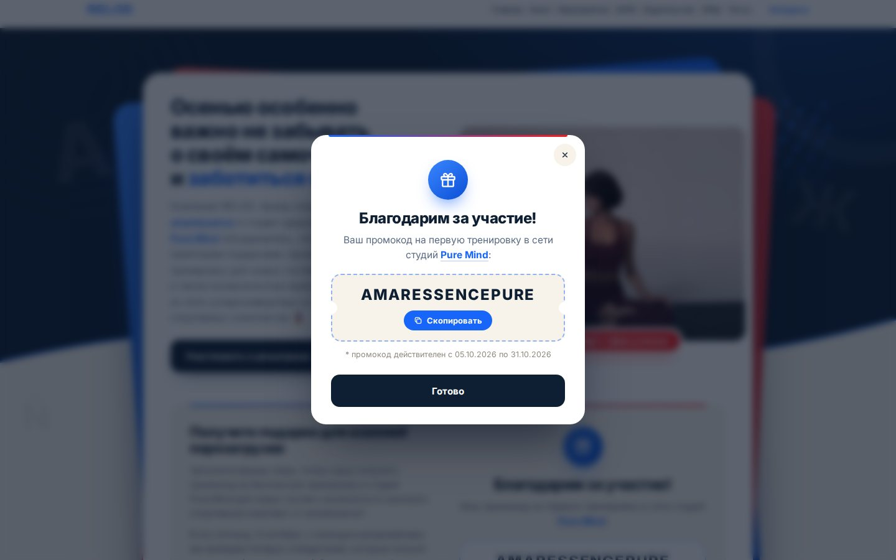

# Розыгрыш ко Дню учителя — лендинг-окно для Tilda

> Палитра: тёмно-синий `#0f1f33` сверху, тёплый молочный `#F7F3EA` снизу (волна с синей линией,
> как на сайте) и подложка формы, акценты — синий `#1866f9` и красный `#f7191d`.

Секции из макета заказчика собраны в одно окно в стиле сайта: тёмно-синий фон, белое окно
с синим и красным листами за ним, кольца, точечная сетка и буквы на фоне.

| Секция | Где в окне |
|---|---|
| 1. Шапка | Нативный хедер, скопированный со страницы /tesol, ставится **над** блоком T123 |
| 2. Первый экран | Верх окна: заголовок, подзаголовок про подарки, кнопка к форме; справа фото с плашкой «5 октября — День учителя» |
| 3. Форма | Молочная панель: заголовок и текст слева, поля, две галочки и кнопка «Забрать промокод…» справа |
| 4. После отправки | Своё окно с промокодом AMARESSENCEPURE и кнопкой «Скопировать»; промокод остаётся и на месте формы |
| 5. Правила и подвал | Под окном: ссылка на PDF правил, организаторы, контакты, соцсети |

На компьютере окно широкое и компактное: текст слева, картинка справа. На телефоне всё
идёт одной колонкой. Форма родная, поэтому заявки уходят в **Tilda CRM** и в раздел «Заявки».

| Компьютер | Телефон | После отправки |
|---|---|---|
|  |  |  |

## Актуальный контент (v5)

- **Первый экран:** заголовок «Осенью особенно важно…», подзаголовок про подарки (промокод на
  бесплатную тренировку и розыгрыш пяти комплектов) со ссылками на [amarèssence](https://amaressence.ru)
  и [Pure Mind](https://puremindpilates.ru/) (новая вкладка), кнопка «Участвовать в розыгрыше» —
  плавно ведёт к форме. Фото — пилатес в Pure Mind.
- **Форма:** заголовок «Получите подарки для осенней перезагрузки», два абзаца текста, поля `name`
  и `email`, скрытое `source=den_uchitelya_2026`, две обязательные галочки (`consent`, `rules`),
  кнопка «Забрать промокод и испытать удачу в розыгрыше», сноска про Москву и студию Pure Mind.
- **Финальное окно после отправки** (своё, в стиле страницы): «Благодарим за участие! Ваш промокод
  на первую тренировку в сети студий Pure Mind:», промокод **AMARESSENCEPURE** с кнопкой
  «Скопировать» и сноска «* промокод действителен с 05.10.2026 по 31.10.2026». Название студии
  ведёт на https://puremindpilates.ru/pure2 (новая вкладка). Окно закрывается крестиком, кнопкой
  «Готово», кликом по фону и клавишей Esc; на телефоне выезжает снизу.
- После закрытия окна благодарность с промокодом **остаётся на месте формы** — код не потеряется.
- Своё окно «Спасибо» у Tilda при этом выключается автоматически (перед отправкой у формы
  снимается `data-success-popup`), поэтому сообщение об успешной отправке в BF204N ни на что не влияет.
  **Не включайте в BF204N переадресацию после отправки** — иначе Tilda уведёт со страницы.

## Идея
## Идея

Форма написана прямо в HTML блока T123, поэтому она видна сразу: и в редакторе, и на сайте.
Отправляет заявки стандартный блок формы Tilda (BF204N) с этой же страницы:

- блок формы Tilda автоматически прячется — на странице его не видно;
- при нажатии «Участвовать» HTML-форма проверяет поля, переносит значения в блок Tilda
  и нажимает его кнопку;
- дальше работает сама Tilda: Tilda CRM, раздел «Заявки», почта, Метрика, окно «Спасибо».

Поля сопоставляются по имени переменной (`name`, `email` …), а если имени нет — по типу поля.
Поля, которых нет в блоке Tilda (например, скрытое `source`), всё равно уходят с заявкой.
Если блока формы на странице нет, форма видна, но при отправке напишет, что не подключена.

## Установка (5 минут)

1. **Создайте пустую страницу**: «Создать страницу», затем «Пустая страница».
2. **Добавьте блок T123**: «Все блоки», раздел «Другое», блок «HTML-код».
   В «Контент» вставьте **весь** код из [`t123-lead-form.html`](t123-lead-form.html).
3. **Над блоком T123 вставьте шапку**: на странице /tesol выберите у хедера «Скопировать блок»
   и вставьте его сюда. Пункт «Конкурсы» отметьте как активный.
4. **Под блоком T123 добавьте блок формы BF204N** («Вертикальная форма с множеством полей»,
   категория «Форма»). В его «Контенте» настройте поля, как в макете:
   - «Имя», переменная `name`, обязательное;
   - «Email», переменная `email`, обязательное;
   - чекбокс согласия, обязательный, со ссылками на политику ПД и правила розыгрыша;
   - скрытое поле `source` со значением `den_uchitelya_2026`, чтобы отличать заявки конкурса;
   - текст кнопки и сообщение об успешной отправке — любые: на странице их не видно,
     а после отправки показывается окно с промокодом из кода T123;
   - переадресацию после отправки не включайте.

   Вид формы и подписи полей задаются в HTML (раздел «КОНТЕНТ»), а не в этом блоке:
   сам блок Tilda на странице не виден.

   Заголовок и описание блока можно не заполнять: на странице они всё равно скрыты.
5. **Подключите Tilda CRM.** В блоке формы откройте «Контент», найдите раздел
   «Приём данных из формы» и отметьте **Tilda CRM**. Если CRM ещё не создана, создайте её
   в главном меню, пункт «CRM». По макету можно добавить и e-mail или Google Таблицу.
6. **Опубликуйте страницу** и отправьте тестовую заявку. Она появится в Tilda CRM и в разделе
   «Заявки» сайта.

> В редакторе Tilda код T123 не выполняется, поэтому там форма стоит отдельным блоком под окном.
> Внутрь окна она встаёт в «Предпросмотре» и на опубликованной странице.

## Как менять контент

Всё, что нужно менять, собрано в начале кода T123 под пометкой `КОНТЕНТ · меняйте здесь`.

| Что | Где |
|---|---|
| Фото | Встроено в код (`window.LF_PHOTO` в конце). Другое фото — ссылка в `src` у ``. |
| Плашка на фото | `<figcaption class="lf__badge">`. Пусто — плашка скроется. |
| Заголовок | `<h1 class="lf__title">`. Текст внутри `<em>` выделяется синим. |
| Подзаголовок | `
` |
| Кнопка первого экрана | `<a class="lf__cta">` |
| Заголовок и текст у формы | `<h2 class="lf__formtitle">` и `
` |
| Поля, галочки, кнопка, сноска | `<form class="lf__hf">`: `name` — имя переменной, `required` — обязательное, `data-error` — текст ошибки |
| Финальное окно | `
`: заголовок, текст со ссылкой на Pure Mind, промокод (`<b class="lf-promo__code">`), срок действия |
| Правила, контакты, соцсети | `<footer class="lf__foot">`: ссылка на PDF правил (сейчас `#`), ссылки VK и Дзен (сейчас `#`) |
| Цвета, шрифт, скругление, ширина окна | Переменные `--lf-…` в «НАСТРОЙКИ ДИЗАЙНА» в начале `<style>` |
| Буквы на фоне | `data-glyphs="A Ж ß é …"` у `#lf-root`. Пусто — без букв. |
| Получатели заявок | В блоке формы BF204N, раздел «Контент» → «Приём данных из формы» |

Что ещё заполнить: ссылку на согласие/политику (`/privacy` в первой галочке), ссылку на PDF правил
(во второй галочке и в подвале, сейчас `#`), ссылки VK и Дзен.

### Если на странице несколько форм

По умолчанию в окно встаёт первая форма на странице. Чтобы выбрать другую, впишите её ID
в `data-form-rec`, например `data-form-rec="rec123456789"`. ID блока написан внизу его
панели «Настройки».

### Если после нажатия «Участвовать» пишет, что форма не подключена

На странице нет блока формы Tilda. Добавьте BF204N и опубликуйте страницу. Если форм несколько,
проверьте ID в `data-form-rec`.

### Как поменять поля формы

Поля — в `<form class="lf__hf">` в разделе «КОНТЕНТ». У каждого поля `name` — это имя переменной,
под которым оно придёт в заявку. Если поле обязательное, оставьте `required`. Чтобы Tilda приняла
заявку, в блоке BF204N обязательными должны быть только те поля, что есть и в HTML-форме.

## Что проверено

Код проверен в Chromium на макете опубликованной страницы Tilda с настоящими скриптами
Tilda (`tilda-forms-1.0`, `tilda-phone-mask-1.1`).

- Блок формы переезжает внутрь окна, а нативные стили Tilda перекрываются.
- Скрытое поле `source=den_uchitelya_2026` уходит вместе с заявкой.
- Валидация и подсветка ошибок работают ([скриншот](screens/errors.jpg)).
- На одно нажатие кнопки уходит **ровно одна** заявка. В ней правильные `formid`,
  `formskey` и получатели (`formservices[]`).
- Окно «Спасибо» оформлено в цветах страницы, на телефоне оно выезжает снизу.
- На ширине 320, 390, 1280 и 1440 px нет горизонтальной прокрутки.
- Если картинка не загрузилась, вместо неё показывается заглушка в фирменных цветах.
- Анимации отключаются, если в системе включено «уменьшение движения».

## Файлы

| Файл | Что это |
|---|---|
| `t123-lead-form.html` | Код для блока T123: его и нужно вставить в Tilda |
| `preview.html` | Демо в браузере. Форма в нём — копия разметки Tilda, заявки не отправляет. Демо собрано из кода блока, поэтому правки в `t123-lead-form.html` в нём не появятся. |
| `screens/` | Скриншоты |
